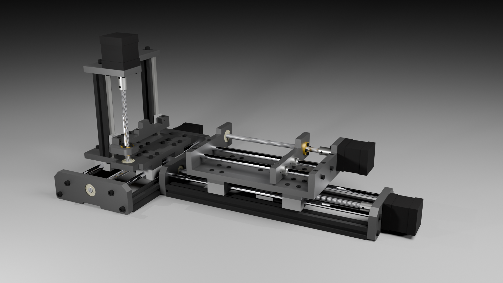

# Automated 3.5-Axis Microphotography Rig

## BOM : Custom Parts

| Drawing | Name | Qty | Material |
| :--- | :--- | :--- | :--- |
| **X-01** | X-Axis Motor Mount Plate | 1 | 12mm Aluminum | [Page 1](./Mechanical_Drawings/Microphotography_Rig_Plans_V1.pdf) |
| **X-02** | X-Axis End Plate | 1 | 12mm Aluminum | [Page 2](./Mechanical_Drawings/Microphotography_Rig_Plans_V1.pdf) |
| **X-03** | X-Axis Carriage Plate | 1 | 10mm Aluminum | [Page 3](./Mechanical_Drawings/Microphotography_Rig_Plans_V1.pdf) |
| **SP-01** | SCS8UU Spacer | 8 | 10mm Aluminum | [Page 4](./Mechanical_Drawings/Microphotography_Rig_Plans_V1.pdf) |
| **SP-02** | T8 Nut Spacer | 2 | 10mm Aluminum | [Page 4](./Mechanical_Drawings/Microphotography_Rig_Plans_V1.pdf) |
| **M-01** | M-axis Motor Mount Plate | 1 | 10mm Aluminum | [Page 5](./Mechanical_Drawings/Microphotography_Rig_Plans_V1.pdf) |
| **M-02** | M-Axis Carriage Plate | 1 | 12mm Aluminum | [Page 7](./Mechanical_Drawings/Microphotography_Rig_Plans_V1.pdf) |
| **M-03** | M-axis End Plate | 1 | 10mm Aluminum | [Page 6](./Mechanical_Drawings/Microphotography_Rig_Plans_V1.pdf) |
| **Y-01** | Y-Axis Motor Mount Plate | 1 | 10mm Aluminum | [Page 9](./Mechanical_Drawings/Microphotography_Rig_Plans_V1.pdf) |
| **Y-02** | Y-Axis End Plate | 1 | 10mm Aluminum | [Page 10](./Mechanical_Drawings/Microphotography_Rig_Plans_V1.pdf) |
| **Z-01** | Z-Axis Carriage Plate | 1 | 10mm Aluminum | [Page 8](./Mechanical_Drawings/Microphotography_Rig_Plans_V1.pdf) |
| **Z-02** | Z-Axis End Plate | 1 | 10mm Aluminum | [Page 11](./Mechanical_Drawings/Microphotography_Rig_Plans_V1.pdf) |
| **Z-03** | Z-Axis Carrier | 1 | 10mm Aluminum | [Page 12](./Mechanical_Drawings/Microphotography_Rig_Plans_V1.pdf) |
| **Z-04** | Specimen holder | 1 | 10mm Aluminum | [Page 13](./Mechanical_Drawings/Microphotography_Rig_Plans_V1.pdf) |
| **Z-05** | Vertical Lead Screw Spacer | 2 | 10mm Aluminum | [Page 13](./Mechanical_Drawings/Microphotography_Rig_Plans_V1.pdf) |

## BOM : Standard Hardware

### Mechanical Components (Structure & Mouvement)
| Category | Component | Specification | Qty |
| :--- | :--- | :--- | :--- |
| **Motors** | Nema 17 Stepper Motor | 50mm body (High torque) | 4 |
| **Frame** | 2020 V-Slot Extrusion | 350mm / 250mm / 150mm | 2 / 2 / 2 |
| **Linear Rods** | Hardened Steel Rods | 8mm (250mm / 200mm / 150mm) | 4 / 2 / 2 |
| **Linear Rails** | MGN7C Linear Rail | 150mm + Carriage | 2 |
| **Lead Screws** | T8 Lead Screw | Lead 2mm (350/250/200/150mm) | 1 / 1 / 1 / 1 |
| **Bearings** | SCS8UU / LM8UU | Linear bearings | 8 / 2 |
| **Transmission** | T8 Brass Nut / Nut Seat | - | 4 / 2 |
| **Transmission** | Rigid Coupler | 5mm to 8mm | 4 |
| **Bearings** | 608ZZ Bearing | 8x22x7mm | 4 |

### Fasteners
| Type | Specification | Qty | Application |
| :--- | :--- | :--- | :--- |
| **M5 Screw** | M5x20mm | 22 | Frame assembly (T-Nuts required) |
| **M4 Screw** | M4x30mm | 48 | Main plates & Carriage assembly |
| **M4 Screw** | M4x10mm | 4 | Fixation Specimen holder & Lead screw spacer to MGN7C |
| **M3 Screw** | M3x12mm | 28 | Motors & small parts |
| **M2 Screw** | M2x20mm | 4 | Linear rails to 2020 Profiles (drilled/tapped) |
| **M2 Screw** | M2x14mm | 4 | Z-axis specific assembly |
| **Grub Screw** | Headless M4x4mm | 16 | Locking components |

### Electronics
| Component | Specification | Qty |
| :--- | :--- | :--- |
| **Control Board** | Makerbase TinyBee | ESP32-based CNC Board | 1 |
| **Stepper Drivers** | TMC2209 | Silent StepStick (Highly recommended) | 4 |
| **Power Supply** | 24V PSU | Recommended 10A+ | 1 |
